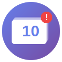

# 📑 Tab Limiter - Chrome Extension

A professional Chrome extension that helps you manage browser tabs by setting a maximum limit and preventing tab overload. Perfect for productivity, performance optimization, and maintaining focus.



## ✨ Features

- **Tab Limiting**: Set a maximum number of open tabs (1-100)
- **Smart Notifications**: Get notified when you reach your limit
- **Multiple Behaviors**: Choose how to handle new tabs:
  - 🚫 **Block**: Prevent new tabs from opening
  - ⚠️ **Warn**: Show warning but allow the tab
  - 🔄 **Auto-Close**: Automatically close the oldest tab
- **Visual Feedback**: Color-coded badge showing current tab count
  - 🟢 Green: Safe zone
  - 🟡 Orange: Near limit (80%+)
  - 🔴 Red: At/over limit
  - ⚪ Gray: Limiter disabled
- **Quick Toggle**: Enable/disable limiting from the popup
- **Persistent Settings**: Settings sync across Chrome sessions
- **Professional UI**: Modern, gradient-based design
- **No Backend Required**: Works completely client-side

## 🚀 Installation

### Method 1: Load Unpacked Extension (Development)

1. **Clone or Download** this repository:
   ```bash
   git clone https://github.com/alexandrosdrivas/tab_limiter.git
   cd tab_limiter
   ```

2. **Icons are already included** (icon16.png, icon48.png, icon128.png)

3. **Open Chrome Extensions Page**:
   - Navigate to `chrome://extensions/`
   - Or click the three dots menu → More Tools → Extensions

4. **Enable Developer Mode**:
   - Toggle the "Developer mode" switch in the top right corner

5. **Load the Extension**:
   - Click "Load unpacked"
   - Select the `tab_limiter` folder
   - The extension will now appear in your extensions list

6. **Pin the Extension** (optional):
   - Click the puzzle icon in the Chrome toolbar
   - Find "Tab Limiter" and click the pin icon

### Method 2: Chrome Web Store (Coming Soon)

*The extension will be available on the Chrome Web Store for one-click installation.*

## 📖 Usage

### Quick Start

1. **Click the Extension Icon** in your Chrome toolbar
2. **Set Your Limit**: Enter your desired maximum tab count (default: 10)
3. **Enable the Limiter**: Toggle the switch to activate
4. **That's it!** The extension will now monitor your tabs

### Popup Interface

The popup provides a quick overview and controls:

- **Current Tabs / Limit**: See your current tab count vs. limit
- **Progress Bar**: Visual indicator of how close you are to the limit
- **Enable Toggle**: Quickly enable/disable the limiter
- **Quick Limit Adjust**: Change your limit on the fly
- **Settings Button**: Open the full settings page

### Settings Page

Access detailed settings by clicking "⚙️ Settings" in the popup or right-clicking the extension icon → Options.

**Available Settings:**

1. **Status**
   - Enable/disable the tab limiter

2. **Tab Limit**
   - Set maximum tabs (1-100)
   - Use slider or input field
   - Real-time preview

3. **Behavior**
   - **Block New Tab**: Closes new tabs exceeding the limit
   - **Warn Only**: Shows notification but allows the tab
   - **Auto-Close Oldest**: Automatically closes the oldest tab to make room

4. **Current Status**
   - View real-time tab count
   - See limiter status

## 🛠️ Technical Details

### Tech Stack

- **Manifest V3** (Latest Chrome Extension standard)
- **Vanilla JavaScript** (No frameworks)
- **HTML5 + CSS3** (Modern gradient design)
- **Chrome APIs**:
  - `chrome.tabs` - Tab management
  - `chrome.storage.sync` - Settings persistence
  - `chrome.notifications` - User notifications
  - `chrome.action` - Badge and popup
  - `chrome.runtime` - Background service worker

### Architecture

```
tab_limiter/
├── manifest.json          # Extension configuration
├── background.js          # Service worker (tab monitoring)
├── popup.html/css/js      # Popup UI
├── options.html/css/js    # Settings page
├── icons/                 # Extension icons
│   ├── icon.svg          # Source SVG
│   ├── icon16.png        # 16x16 icon
│   ├── icon48.png        # 48x48 icon
│   └── icon128.png       # 128x128 icon
└── README.md             # This file
```

### How It Works

1. **Background Service Worker** (`background.js`):
   - Listens for `chrome.tabs.onCreated` events
   - Queries current tab count
   - Compares against stored limit
   - Takes action based on behavior setting
   - Updates badge with color-coded count

2. **Storage** (`chrome.storage.sync`):
   - Stores settings across Chrome sessions
   - Syncs across devices (if Chrome sync enabled)
   - Default settings: 10 tabs, blocking enabled

3. **Badge Counter**:
   - Shows current tab count
   - Color changes based on status:
     - Green (safe) → Orange (warning) → Red (limit)
